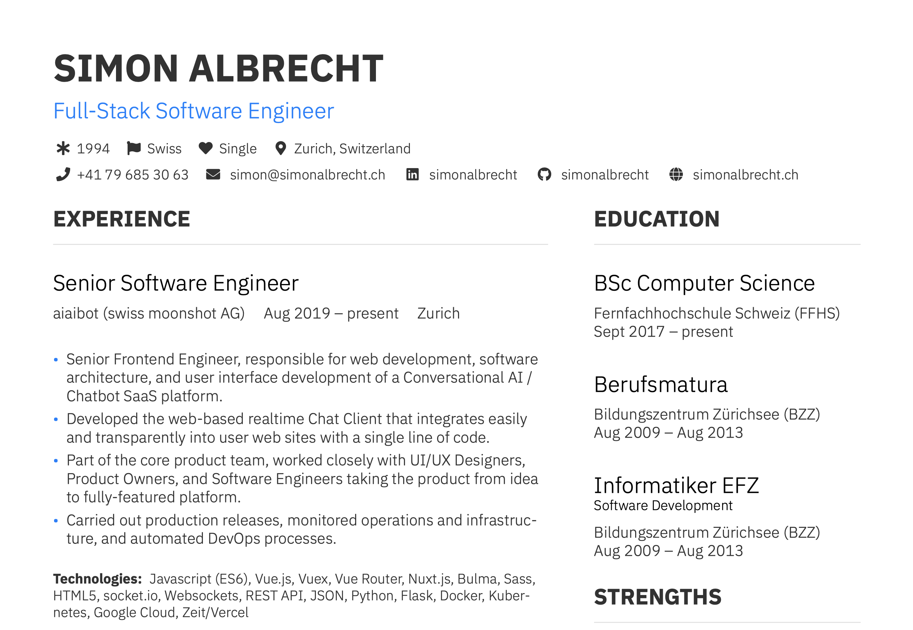

# Curriculum Vitae

  

This repository contains the LaTex sources for Simon Albrecht's Curriculum Vitae. 

The layout is based on the [AltaCV](https://github.com/liantze/AltaCV) template. The font is [Fira Sans](https://mozilla.github.io/Fira/).

## Download
* Download the [latest version of the CV](https://github.com/simonalbrecht/curriculum-vitae/releases/download/v1.1.0/cv-simon-albrecht.pdf)

## Getting Started
* Install [TeX Live](https://tug.org/texlive/) or [MacTeX](https://tug.org/mactex/)
* Make sure `pdflatex` is installed
* Compile with `$ pdflatex cv-simon-albrecht.tex`

## Copyright and license
Licensed under the BSD-3-Clause license.  

Copyright (c) 2019, Simon Albrecht  
All right reserved.